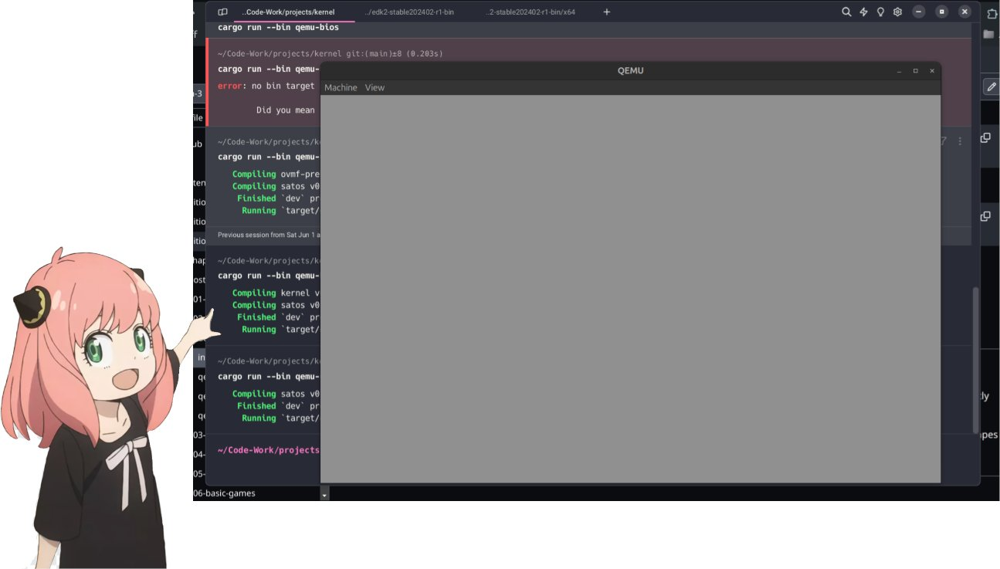
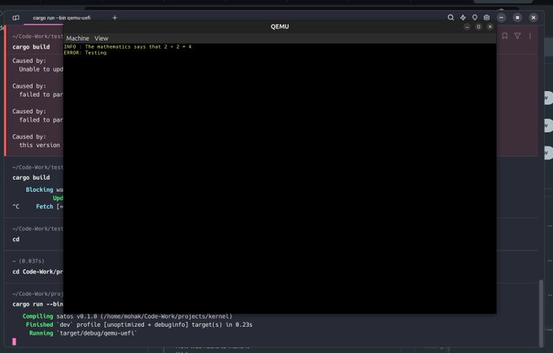
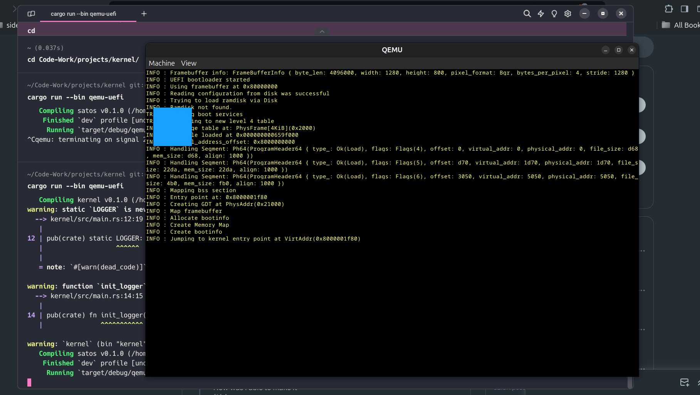

# OS from Scratch in Rust


To run the project, you need to have cargo installed
on your system. You can download it from https://rustup.rs/

## Building the project

Run `cargo build` from the root or `cargo build --release`
for more optimized build.

You need to have QEMU system emulator which can be installed
from here https://www.qemu.org/download/

## Running the project

The project can be run using the following commands 
```
# To run the BIOS image
cargo run --bin qemu-bios

# To run the UEFI image
cargo run --bin qemu-uefi
```

## Rendering text and color in UEFI

